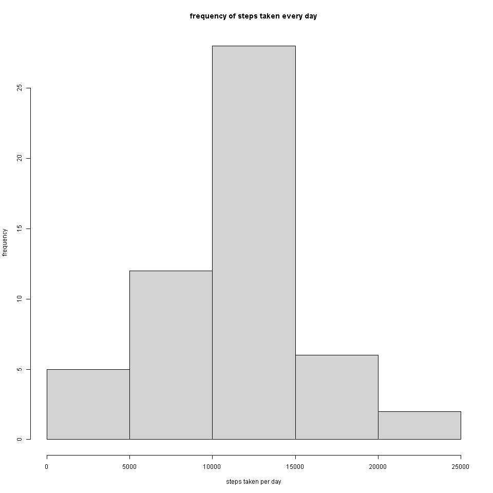
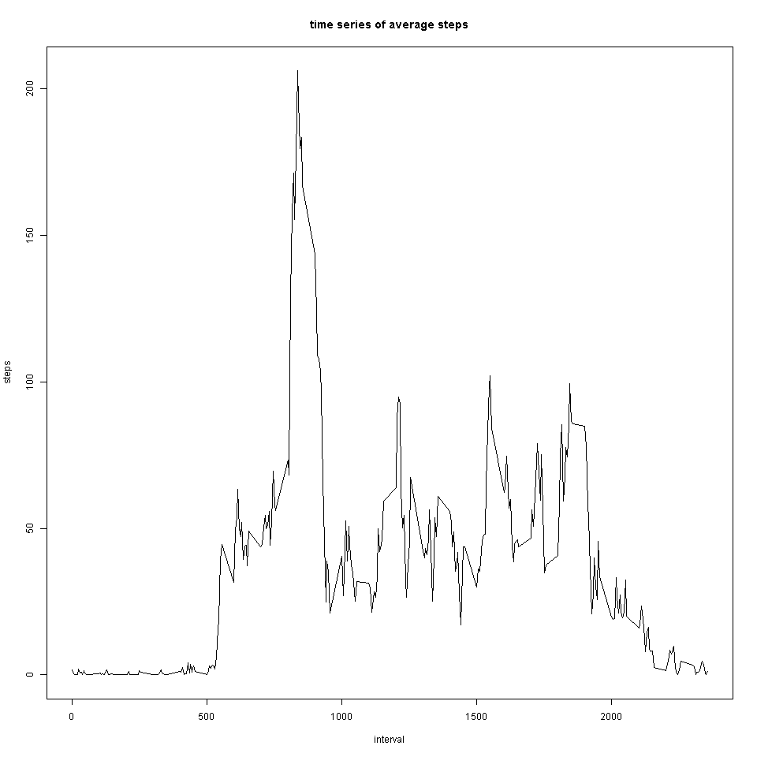
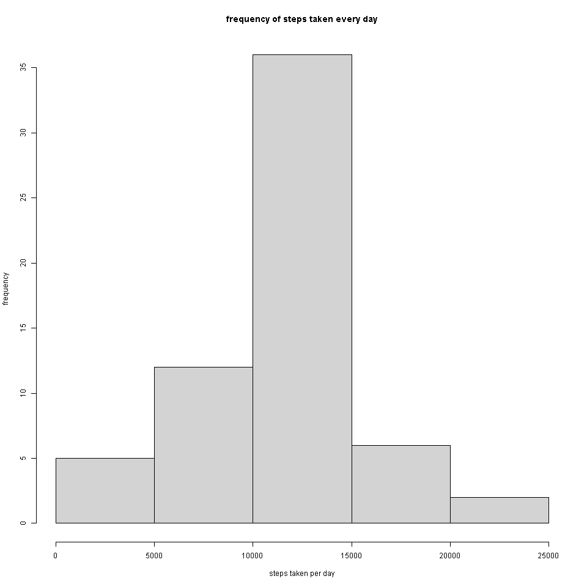
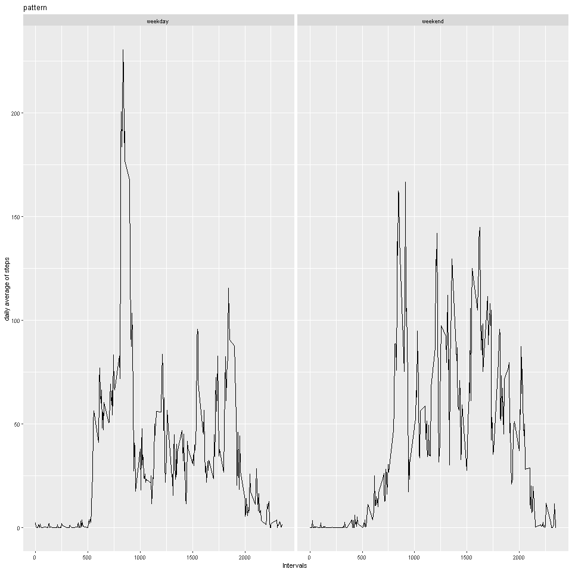

# Reproducible Research Week 2 Assignment


## Question 1 - Code for reading and processing data

### I have already downloaded and extracted the zip file provided in the assignment.

### The following processes have been done to the data:

### read.csv to read the data into RStudio.

### as.date to change the class of the values in the date column to a date type

### I then added 2 more columns "day" and "month" and extracted those values from the date column using the lubridate package


```r
library(lubridate)
a = read.csv("activity.csv")
a$date = as.Date(as.character(a$date, "%d-%m-%Y"))
a$day = day(a$date)
a$month = month(a$date)
```


## Question 2 - Histogram of the total number of steps taken each day

### Using the previous dataframe "a", I created an aggregate of the sum of steps by days and months


```r
b = aggregate(a$steps ~ a$day + a$month, data = a, FUN = sum, na.rm = TRUE)
png( filename = "question2.png", width = 960, height = 960)
#created a png file in advance so that there is no issue in fitting the entire plot
hist(b$`a$steps`, breaks = seq(0 , 25000, by = 5000), xlab = "steps taken per day", ylab = "frequency", main = "frequency of steps taken every day")
axis(1, at=c(0, max(b$`a$steps`)), labels=c("",""), lwd.ticks=0)
axis(1, at=seq(0 , max(b$`a$steps`), by=5000), lwd=0, lwd.ticks=1)
dev.off()
```

```
## png 
##   2
```

```r
library(knitr)

```


## Question 3 - Mean and median number of steps taken each day

### A simple summary of the above dataframe gives us the mean and the median of the correct data


```r
summary(b)
```

```
##      a$day          a$month         a$steps     
##  Min.   : 2.00   Min.   :10.00   Min.   :   41  
##  1st Qu.:10.00   1st Qu.:10.00   1st Qu.: 8841  
##  Median :17.00   Median :10.00   Median :10765  
##  Mean   :16.68   Mean   :10.45   Mean   :10766  
##  3rd Qu.:24.00   3rd Qu.:11.00   3rd Qu.:13294  
##  Max.   :31.00   Max.   :11.00   Max.   :21194
```


## Question 4 - Time series plot of the average number of steps taken

### Using the original dataframe "a", we use an aggregate of the steps by the interval and calculate the mean. What is happening here:

### 1. For eg. we take the interval = 5
### 2. We extract all the steps value whose interval = 5
### 3. We take the mean of those values
### 4. this value is then plotted against the interval value of 5


```r
d = aggregate(a$steps ~ a$interval, data = a, FUN = mean)
png( filename = "question4.png", width = 960, height = 960)
#created a png file in advance so that there is no issue in fitting the entire plot
plot(d$`a$interval`, d$`a$steps`, type = "l", xlab = "interval", ylab = "steps", main = "time series of average steps")
dev.off()
```

```
## png 
##   2
```

```r
library(knitr)

```


## Question 5 - The 5-minute interval that, on average, contains the maximum number of steps

### We find out the maximum value of steps in the dataframe "d" and extract the corresponding interval value


```r
d$`a$interval`[d$`a$steps` == max(d$`a$steps`)]
```

```
## [1] 835
```


## Question 6 - Code to describe and show a strategy for imputing missing data

### I have constructed a for loop to calculate appropriate values to be imputed. The steps are:

### 1. Create a new dataframe "f" which is a copy of the orginal dataframe "a"
### 2. The for loop will check if any "steps" value is "NA"
### 3. If a "NA" value is detected, the corresponding "interval" value is extracted
### 4. A process similar to Question 4 is carried out where the mean of the non-NA steps are calculated correponding to the extracted "interval" value
### 5. This mean is imputed in place of NA


```r
head(a, 20)
```

```
##    steps       date interval day month
## 1     NA 2012-10-01        0   1    10
## 2     NA 2012-10-01        5   1    10
## 3     NA 2012-10-01       10   1    10
## 4     NA 2012-10-01       15   1    10
## 5     NA 2012-10-01       20   1    10
## 6     NA 2012-10-01       25   1    10
## 7     NA 2012-10-01       30   1    10
## 8     NA 2012-10-01       35   1    10
## 9     NA 2012-10-01       40   1    10
## 10    NA 2012-10-01       45   1    10
## 11    NA 2012-10-01       50   1    10
## 12    NA 2012-10-01       55   1    10
## 13    NA 2012-10-01      100   1    10
## 14    NA 2012-10-01      105   1    10
## 15    NA 2012-10-01      110   1    10
## 16    NA 2012-10-01      115   1    10
## 17    NA 2012-10-01      120   1    10
## 18    NA 2012-10-01      125   1    10
## 19    NA 2012-10-01      130   1    10
## 20    NA 2012-10-01      135   1    10
```

```r
# as you can see all the "steps" values are NAs
f = a
seq = 1 : length(f$steps)
for (i in seq){
  if (is.na(f$steps[i])){
      interval1 = f$interval[i]
      mean1 = mean(f$steps[f$interval == interval1], na.rm = TRUE)
      f$steps[i] = mean1
      
  }
}
head(f, 20)
```

```
##        steps       date interval day month
## 1  1.7169811 2012-10-01        0   1    10
## 2  0.3396226 2012-10-01        5   1    10
## 3  0.1320755 2012-10-01       10   1    10
## 4  0.1509434 2012-10-01       15   1    10
## 5  0.0754717 2012-10-01       20   1    10
## 6  2.0943396 2012-10-01       25   1    10
## 7  0.5283019 2012-10-01       30   1    10
## 8  0.8679245 2012-10-01       35   1    10
## 9  0.0000000 2012-10-01       40   1    10
## 10 1.4716981 2012-10-01       45   1    10
## 11 0.3018868 2012-10-01       50   1    10
## 12 0.1320755 2012-10-01       55   1    10
## 13 0.3207547 2012-10-01      100   1    10
## 14 0.6792453 2012-10-01      105   1    10
## 15 0.1509434 2012-10-01      110   1    10
## 16 0.3396226 2012-10-01      115   1    10
## 17 0.0000000 2012-10-01      120   1    10
## 18 1.1132075 2012-10-01      125   1    10
## 19 1.8301887 2012-10-01      130   1    10
## 20 0.1698113 2012-10-01      135   1    10
```

```r
# now you can see that the appropriate values have been imputed
```


## Question 7 - Histogram of the total number of steps taken each day after missing values are imputed

### This will be calculated in a manner similar to Question 2, only the dataframe changes


```r
g = aggregate(f$steps ~ f$day + f$month, data = f, FUN = sum, na.rm = TRUE)
png( filename = "question7.png", width = 960, height = 960)
#created a png file in advance so that there is no issue in fitting the entire plot
hist(g$`f$steps`, breaks = seq(0 , 25000, by = 5000), xlab = "steps taken per day", ylab = "frequency", main = "frequency of steps taken every day")
axis(1, at=c(0, max(g$`f$steps`)), labels=c("",""), lwd.ticks=0)
axis(1, at=seq(0 , max(g$`f$steps`), by=5000), lwd=0, lwd.ticks=1)
dev.off()
```

```
## png 
##   2
```

```r
library(knitr)

```


```r
# as we can see, the impact of imputing missing data is that the max frequency has increased to 35
```


## Question 8 - Panel plot comparing the average number of steps taken per 5-minute interval across weekdays and weekends

### We will use the dataframe "f", since it has all the necessary imputed values. Since we have to plot according to whether the day is a weekday or a weekend, I created a new variable in the dataframe - "daytype"


```r
f$day.num = wday(f$date)
f$daytype = ifelse(f$day.num == 1 | f$day.num == 7, "weekend", "weekday")
```

### We then aggregate the steps by interval and daytype


```r
h = aggregate(f$steps ~ f$interval + f$daytype, data = f, FUN = mean)
```

### I then use the ggplot2 package to create a panel plot


```r
library(ggplot2)
png( filename = "question8.png", width = 960, height = 960)
#created a png file in advance so that there is no issue in fitting the entire plot
i = ggplot(data = h, mapping = aes(h$`f$interval`, h$`f$steps`))
i + geom_line() + facet_wrap(. ~ h$`f$daytype`) + labs(x = "Intervals", y = "daily average of steps", title = "pattern")
```

```
## Warning: Use of `h$`f$interval`` is discouraged. Use `f$interval` instead.
```

```
## Warning: Use of `h$`f$steps`` is discouraged. Use `f$steps` instead.
```

```r
dev.off()
```

```
## png 
##   2
```

```r
library(knitr)

```


```r
# We notice that during weekdays, the number of steps taken is higher in the beginning of the day while during weekends the number of steps are spread more evenly throughout the day
```
